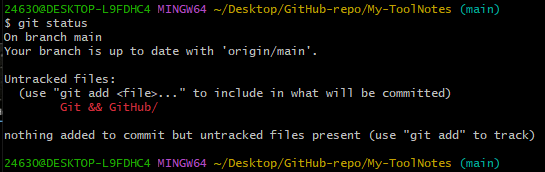
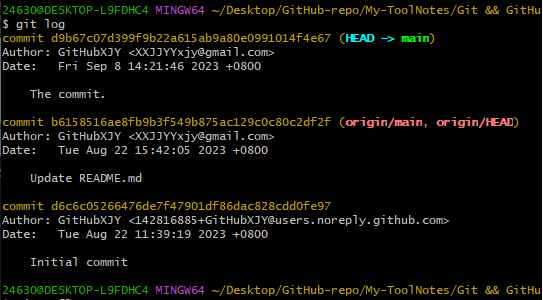
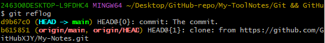

### Git 命令行操作

#### 1. 创建库

1.1 本地库初始化

`git init`：在当前目录，初始化一个空的本地仓库，生成一个`.git`文件夹，存放本地库相关的目录和文件。

1.2 设置签名

签名内容包括：

- 用户名：`user.name NAME`
- Email地址：`user.mail EMAIL@mail.com`

用于区分不同开发人员的身份。但是用户托管中心(GitHub)的用户名与Email地址和这里的签名设置没有关系。

- 项目级别/仓库级别

`git config user.name NAME_pro`
`git config user.email EMAIL_pro@email.com`

仅在当前本地仓库范围内有效

- 系统用户级别

`git config --global user.name NAME_glb`
`git config --global user.email EMAIL_glb@email.com`

对当前操作系统的所有用户生效

二者都有时项目级别的设置优先级更高，不允许二者都没有

#### 2. 提交

2.1 查看仓库状态

`git status`

查看工作区、缓存区的状态

2.2 添加操作

`git add FILENAME`

将工作区的内容添加到缓存区

`git add .`：添加工作区内的所有文件

2.3 撤销添加到缓存区

`git rm --cached FILENAME`

将`add`到缓存区的内容撤销添加。只会删除缓存区的内容，不会删除工作区的内容。

2.4 提交到本地库

`git commit FILENAME`

将缓存区内的内容提交到本地库
默认进入`vim`进行提交说明，也可以使用`-m`命令简化：

`git commit -m "提交说明" FILENAME`

2.5 查看提交日志

`git log`：显示提交的版本，和当前位于哪个版本(HEAD指针指向)

`git log --[pretty=]oneline`：简化显示的信息

`git reflog`：显示提交版本，和回退到某个版本需要的步数

#### 3. 历史版本控制

Git 在管理各个历史版本时，借助于一个指针`HEAD`，指针指向当前版本。
版本的前进与回退就是改变`HEAD`指针指向的内容。

3.1 基于索引值

`git reset --hard INDEX`

3.2 使用`^`符号

`git reset --hard HEAD^`：后退一个版本
`git reset --hard HEAD^^`：后退两个版本，以此类推

这种方式只能版本后退，不能前进。

3.3 使用`~`符号

`git reset --hard HEAD~N`：后退N个版本

这种方法只能版本后退，不能前进。

3.4 `reset`的参数

`--soft`：不会改变工作区和缓存区，仅仅是在本地库移动`HEAD`指针。

`--mixed`：不会改变工作区，会重置缓存区和在本地库移动`HEAD`指针。

`--hard`：重置工作区，重置缓存区，在本地库移动`HEAD`指针。

#### 4. 文件

4.1 比较文件差异

`git diff FILENAME`：将工作区的文件与缓存区内的文件进行比较

`git diff "本地库中某个历史版本" FILENAME`：将工作区内的文件与本地库的历史记录进行比较

如果不加`FILENAME`参数则是比较所有文件。

4.2 删除文件找回

删除文件找回是在工作区新建一个文件`add`到缓存区再`commit`到本地库之后，在工作区删除这个文件，并将删除文件的命令记录`add`到缓存区再`commit`到本地库之后，想要找回这个文件，是借助版本回退命令，回退到删除文件之前的那一个`commit`的版本。

如果删除文件的命令记录只`add`到缓存区，并未`commit`到本地库，则是回退到当前版本，但参数是`--hard`，即`HEAD`指针实际上并未移动，只是重置缓存区和工作区。

#### 5. 分支管理

创建多个分支可以同时并行推进多个功能的开发，提高开发效率。
各个分支在开发过程中相互独立，互不影响。

5.1 创建分支

`git branch branch_NAME`

5.2 查看分支
`git branch -v`：查看所有分支

5.3 切换分支

`git checkout branch_NAME`

5.4 合并分支

首先切换到接受合并的分支上(一般是master分支)，然后执行`merge`命令：

`git merge branch_NAME`

"branch_name"是需要将其内容合并到接受合并分支的分支名(被合并分支)。

5.5 解决冲突

冲突：一般是接受合并的分支和被合并的分支修改了同一个文件的同一部分的内容。

进行合并时，直接使用`merge`进行合并时，会提示合并失败，并自动进入手动合并状态;

在手动合并状态下，打开有冲突需要手动合并的文件，**git 会自动为有冲突的文件添加冲突信息**，修改文件到满足要求的程度，完成后保存退出；

然后`add`修改后的文件：
`git add FILENAME`

再`commit`(不带文件名参数)：
`git commit [-m "日志信息"]`

提交后冲突解决，自动退出合并状态。
